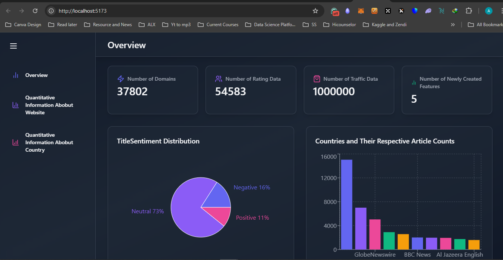
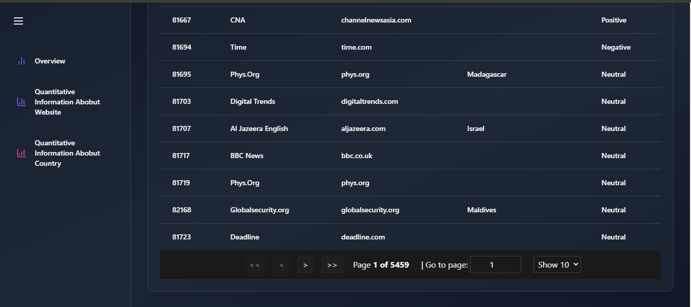
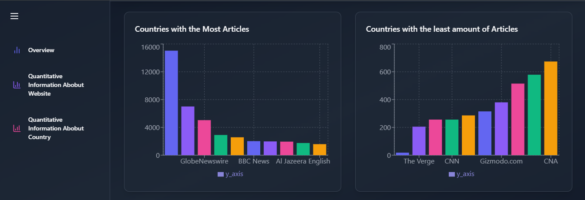
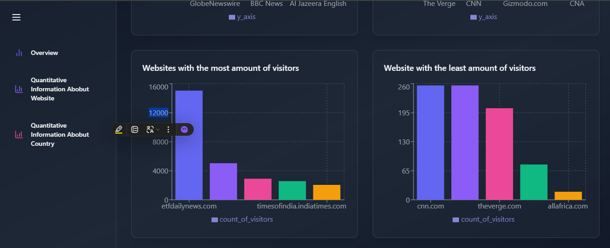
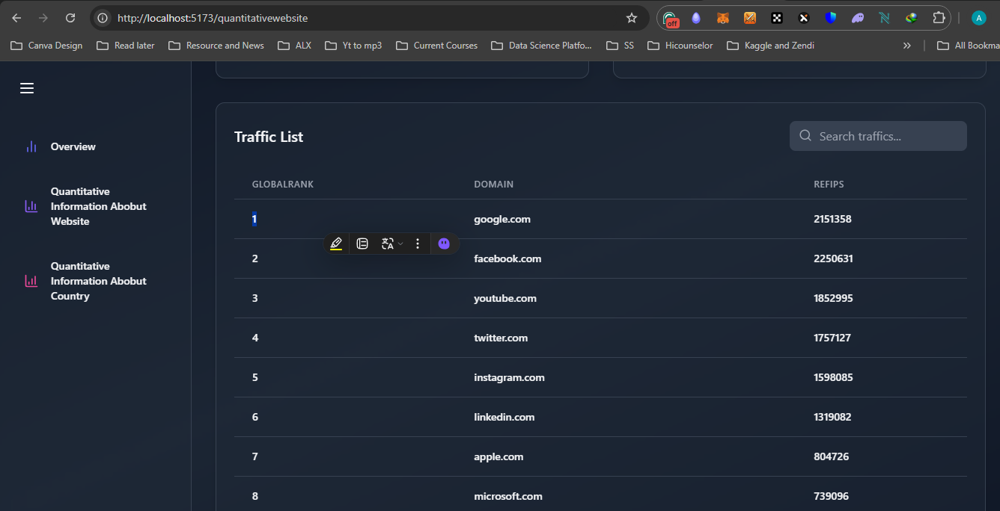
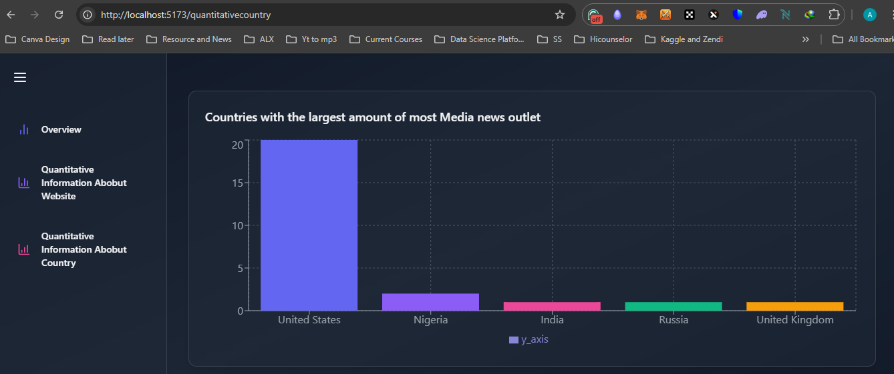
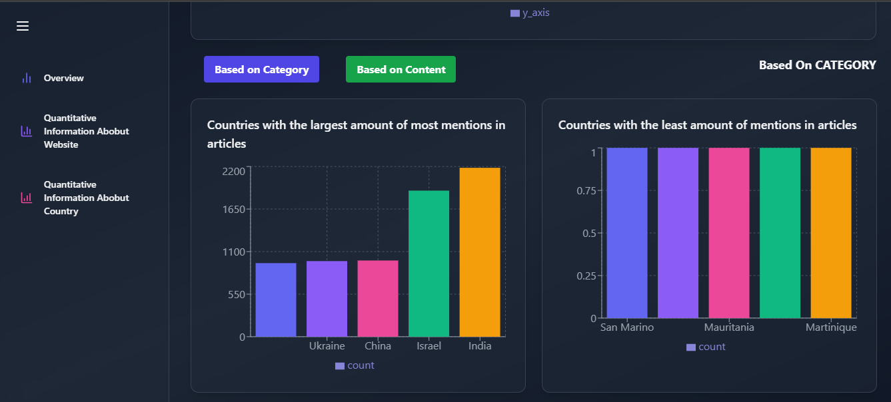

# React & Flask Application

This project is a web application built with a **React** frontend and a **Flask** backend. The application provides insights and analysis related to websites and domains. It consists of three main pages:

1. **Overview**
2. **Quantitative Information About Websites**
3. **Domain Analysis**

## Project Structure

- **Frontend**: React.js (with Vite for bundling)
- **Backend**: Flask (Python)
- **Database**: PostgreSQL (or any other as needed)
- **Deployment**: Docker (optional for both frontend and backend)

### Key Features

- Displaying general information on websites/domains.
- Providing quantitative metrics on website performance, such as traffic, rankings, etc.
- Detailed domain analysis with relevant data visualizations.

---

## Pages

### 1. Overview

The **Overview** page provides a high-level summary of the available data, including key statistics and insights about websites and domains. Users can quickly get an idea of the general landscape of the data being analyzed. 

- **Purpose**: Introduce the users to the platform and give them a summary of the data.
- **Data**: Key statistics like total number of websites/domains analyzed, top domains by traffic, etc.
- **Technologies**: React components with API calls to Flask for dynamic data loading.

### 2. Quantitative Information About Websites

The **Quantitative Information About Websites** page focuses on providing detailed metrics and performance data for each website. This includes:

- **Traffic Statistics**: Views, unique visitors, bounce rate, etc.
- **Rankings**: Global and country-based rankings.
- **Other Metrics**: Time spent on the website, click-through rate, etc.

The data is visualized using charts and tables, allowing users to compare different websites easily.

- **Purpose**: Help users understand the performance and metrics of different websites.
- **Data**: Quantitative metrics such as traffic, ranking, and other performance indicators.
- **Technologies**: Data visualizations with libraries like Chart.js or D3.js for frontend, and Flask API for backend data serving.

### 3. Domain Analysis

The **Domain Analysis** page provides in-depth information about individual domains, including historical data, sentiment analysis, and any anomalies detected in the domain's performance.

- **Purpose**: Offer detailed analysis and breakdowns for specific domains.
- **Data**: Historical data, keyword analysis, SEO metrics, and sentiment analysis.
- **Technologies**: Word clouds, charts, and domain-specific visualizations for insights.

---

## Technologies

### Frontend

- **React**: The application’s frontend is built using React, offering a dynamic and responsive user interface.
- **React Router**: For navigating between the different pages of the application.
- **Axios**: Used for making HTTP requests to the Flask backend API.
- **Vite**: For fast development and bundling.
- **Bootstrap**: For styling and layout, creating a responsive UI.

### Backend

- **Flask**: A lightweight Python framework that handles API requests from the frontend and serves data from the database.
- **Flask-CORS**: To handle Cross-Origin Resource Sharing between the React frontend and Flask backend.
- **Flask-Restful**: For organizing API routes and delivering data.
- **PostgreSQL**: The database to store website and domain information.

