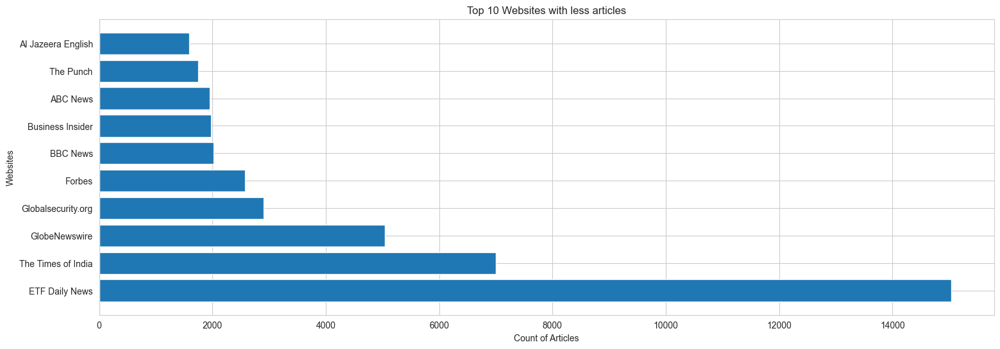

#  Exploratory Data Analysis (EDA)

##  Importing and Cleaning the Dataset

 Our next step is to import the dataset we have exported. Once the data is loaded, we begin the essential task of text cleaning.

###  Text Cleaning Procedures:

-  **Removing Stopwords:** We eliminate common words that do not contribute meaningful information to the analysis, such as "and" or "the."
-  **Lowercasing:** Converting all text to lowercase to ensure uniformity and prevent case sensitivity issues.
-  **Removing Punctuation:** Stripping out punctuation marks to simplify the text and focus on the core content.
-  **Normalization Using Lemmatization:** Applying lemmatization to reduce words to their base or root form. This step helps consolidate similar words and improves the consistency of the analysis.

 After cleaning the text, we can proceed to draw insigts like 

 - **Top and Bottom 10:**
  - Top 10 websites with the largest count of news articles

  - Bottom 10 websites with the largest count of news articles

- **Websites with the Highest Numbers of Visitors Traffic**

- **Websites with the Lowest Numbers of Visitors Traffic**

- **Countries with the Highest Number of News Media Organisations:**
  - Represented by domains in the data

- **Countries with Many Articles Written About Them:**
  - The content of the news is about that country

- **Reporting About Specific Regions:**
  - Africa
  - US
  - China
  - EU
  - Russia
  - Ukraine
  - Middle East
    - Note: Group countries to form the African, EU, and Middle East continents/regions

- **Sentiment Analysis by Website:**

- **Compare Content Metadata Across Sites:**
  - Similarity in raw message lengths across sites
    - Check distribution among sites

  - Similarity in raw content lengths across sites
    - Check distribution among sites

 