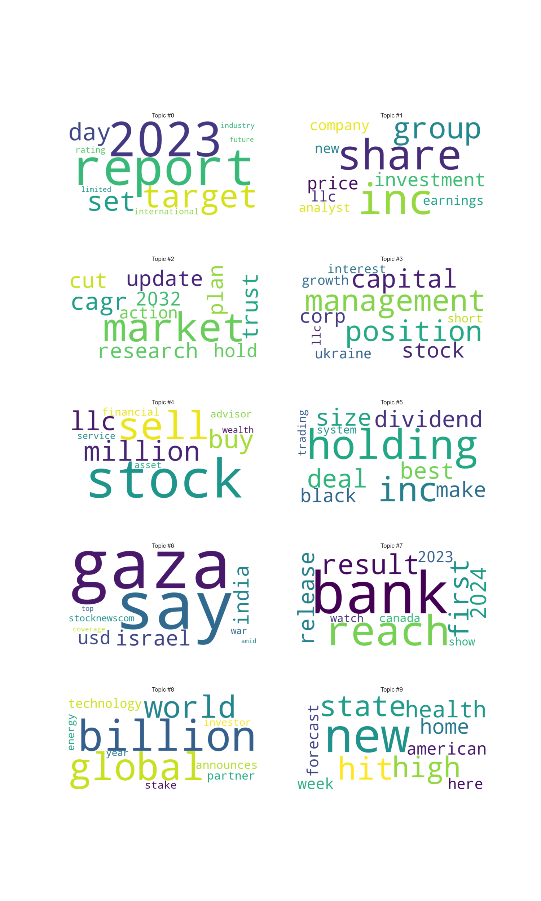

 # Data Science Component Building

 With our data now in a CSV format, we turned our attention to building the data science components of our project. This phase involved several key tasks:

 - **Classification of Headlines**: Determining the category or topic of each headline.
 - **Topic Modeling**: Identifying and extracting the underlying themes from the text.
 - **Sentiment Analysis**: Analyzing the emotional tone of the content.
 - **Predictive Analysis and Modeling**: Making predictions based on the data.

 ## Tools and Techniques
 In the data science phase, we leverage several tools and techniques to perform critical tasks:

 - **Natural Language Toolkit (NLTK)**: A powerful library for processing textual data. It provides functionalities for tokenization, stopword removal, and text normalization.
 - **Scikit-learn (sklearn)**: A versatile library used for machine learning. It includes tools for classification, regression, clustering, and dimensionality reduction.
 - **Gensim**: A library specialized in topic modeling and document similarity analysis. It supports advanced methods like Latent Dirichlet Allocation (LDA) for extracting topics from text.

 ## Importing and Cleaning the Dataset
 Our next step is to import the dataset we have exported. Once the data is loaded, we begin the essential task of text cleaning.

 ### Text Cleaning Procedures:
 - **Removing Stopwords**: We eliminate common words that do not contribute meaningful information to the analysis, such as "and" or "the."
 - **Lowercasing**: Converting all text to lowercase to ensure uniformity and prevent case sensitivity issues.
 - **Removing Punctuation**: Stripping out punctuation marks to simplify the text and focus on the core content.
 - **Normalization Using Lemmatization**: Applying lemmatization to reduce words to their base or root form. This step helps consolidate similar words and improves the consistency of the analysis.

 After cleaning the text, we replace the old content with the cleaned version and move on to analyzing the similarity between topics and content.

 ## Similarity Analysis
 To measure the similarity between the titles and content of the articles, we use the TfidfVectorizer to convert the text into numerical features. We then apply cosine similarity to assess how closely related the title is to the content.

 ### Creating a New Feature:
 - **Histogram Analysis**: We plot a histogram of similarity scores. The resulting graph is right-skewed, indicating that most similarity scores are below 0.5. This suggests a weak similarity between titles and content, pointing to diverse or less relevant titles.

 ## Keyword Extraction and Feature Creation

 ### Extracting Keywords
 Keywords play a critical role in model building as they help in identifying and categorizing the core topics of articles. We employ keyword extraction techniques to identify significant terms and create new features for our dataset.

 #### Techniques Used:
 - **TF-IDF (Term Frequency-Inverse Document Frequency)**: To determine the importance of words in the context of the entire corpus.

 ### Feature Creation
 With the keywords extracted, we add a new feature column to our dataset. This feature will be essential for subsequent topic modeling and classification tasks.

 ## Classification and Topic Modeling

 ### Categorizing Articles
 To classify articles into various categories, we create predefined categories based on extracted keywords. We then combine these keywords with the article titles to form a comprehensive feature set.
 

 #### Classification Process:
 - **Combining Title and Keywords**: We merge the title with the extracted keywords to enhance the accuracy of topic classification.
 - **Categorization**: We implement a loop to compare keyword similarity and categorize articles accordingly.

 ### Topic Modeling Approaches
 We utilize two primary approaches for topic modeling:

 - **TF-IDF with Truncated SVD**:
   - **Objective**: Reduce dimensionality and identify topics within the dataset.
   - **Findings**: We observe that many topics contain overlapping keywords, such as those related to stocks and shares. A unique topic identified is related to the conflict between Israel and Hamas.

 - **Latent Dirichlet Allocation (LDA)**:
   - **Objective**: Discover hidden topics in the documents.
   - **Findings**: LDA provides a more diverse set of topics compared to the TF-IDF approach. Articles are more evenly distributed across topics, which is confirmed by plotting a pie chart showing the distribution of topics.

 ### Visualization:
 - **Word Clouds**: We generate word clouds to visualize the most frequent terms in each topic, aiding in the interpretation of the content.

 ## Event Modeling

 ### KMeans Clustering
 For event modeling, we apply KMeans clustering to group articles based on their content. Our goal is to find the optimal number of clusters to accurately represent different events.

 #### Finding Optimal Clusters:
 - **Testing Cluster Values**: We test values from 2 to 21 to determine the optimal number of clusters.
 - **Elbow Method**: We use the Elbow Method to evaluate the Within-Cluster Sum of Squares (WCSS). Based on this analysis, we select an optimal cluster value between 10 and 12, settling on 11.

 ### Dimensionality Reduction and Visualization
 - **PCA (Principal Component Analysis)**: We reduce feature dimensions and create scatter plots to visualize clusters.
 - **Cluster Analysis**: We notice that many clusters are merged, indicating articles that are not easily classified as specific events.

 ### Refined Clustering
 To address the challenge of overlapping clusters, we use a larger cluster size of 500 to classify events more granularly.

 - **Unique Events**: We identify 494 unique events after training the model.
 - **Event Insights**: We note that sites like GlobalNewswire and Marketscreener report many events. Key reporting topics include Google reviews, climate change, and geopolitical events related to China and Russia.

## Exporting Data to PostgreSQL Database

 After completing the data analysis and feature creation, the final step is to export the results to a PostgreSQL database. This can be done for both local databases and online databases like Amazon RDS.

 ### Export Process:

 1. **Database Configuration**: First, set up your database configuration using environment variables for security and flexibility:

 2. **Database Exporter Class**: Create an instance of the `DatabaseExporter` class with the database credentials.

 3. **Prepare DataFrames**: We map our DataFrames to a dictionary to manage the export of multiple datasets, such as `rating`, `domains_location`, and `traffic`.

 4. **Running the Exporter**: Execute the export process using the `run` method, which exports the data to the connected PostgreSQL database.

